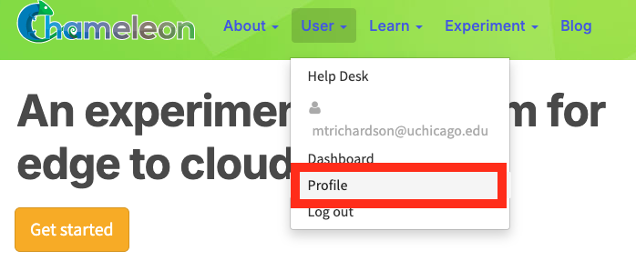
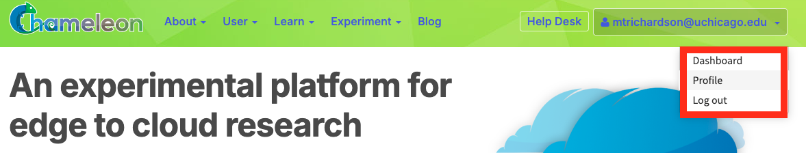
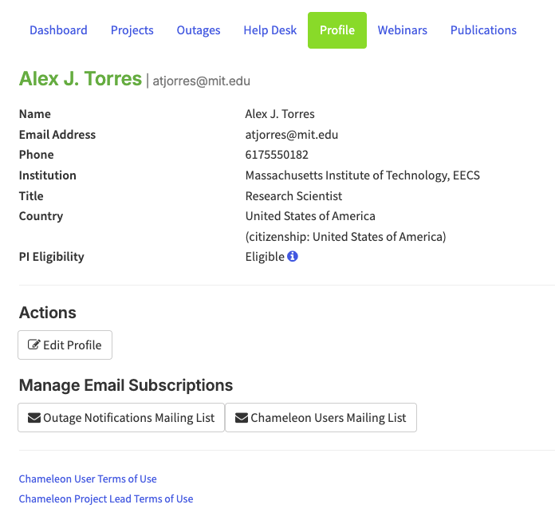
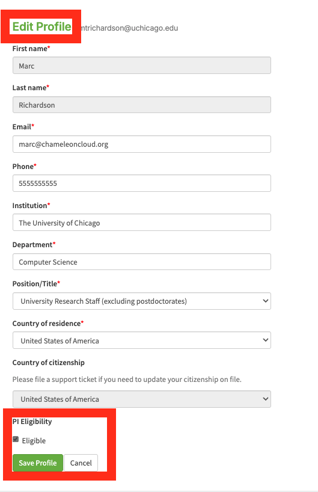

.. _profile-page:

============
User Profile
============

  Navigate to the user profile page through the **User** tab

Accessing Your Profile
======================

You can reach your Profile page via:

- **The user dashboard**: Select the **Profile** tab from the :ref:`User Dashboard <dashboard-page>`.
- **The navigation bar**: Click your name in the top-right corner of any
  portal page, or hover over the **User** tab, and select **Profile** from the
  dropdown menu.

Profile Overview
================

  The Profile page

The Profile page shows summary of your account information:

+---------------------+-----------------------------------------------------------------------+
| Field               | Description                                                           |
+=====================+=======================================================================+
| Name                | Your full name                                                        |
+---------------------+-----------------------------------------------------------------------+
| Email Address       | The email address associated with your account                        |
+---------------------+-----------------------------------------------------------------------+
| Phone               | Your contact phone number                                             |
+---------------------+-----------------------------------------------------------------------+
| Institution         | Your institution and department                                       |
+---------------------+-----------------------------------------------------------------------+
| Title               | Your position or role                                                 |
+---------------------+-----------------------------------------------------------------------+
| Country             | Your country of residence, with country of citizenship in parentheses |
+---------------------+-----------------------------------------------------------------------+
| PI Eligibility      | Your current PI eligibility status                                    |
+---------------------+-----------------------------------------------------------------------+

Editing Your Profile
====================

  
  Edit profile page

Click **Edit Profile** to open the edit form. Update account fields, then click
**Save Profile** to apply your changes or **Cancel** to return to the profile
view without saving. You can also **request Principal Investigator (PI)
eligibility** if you do not have it already from this page. See more about
requesting PI status in :doc:`PI Eligibility <pi_eligibility>`.

.. warning::

   **Country of citizenship and name** cannot be edited directly. To
   these fields, you must file a support ticket.

Managing Email Subscriptions
============================

Your profile page provides access to two mailing lists. Click either button to open the
external subscription page where you can subscribe or unsubscribe:

- **Outage Notifications Mailing List** — Notifications about system outages
- **Chameleon Users Mailing List** — General Chameleon user community announcements

Terms of Use
============

Links to the following terms of use documents are available at the bottom of the profile page:

- **Chameleon User Terms of Use** — Applicable to all users
- **Chameleon Project Lead Terms of Use** — Applicable to users who act as project leads (PIs)
