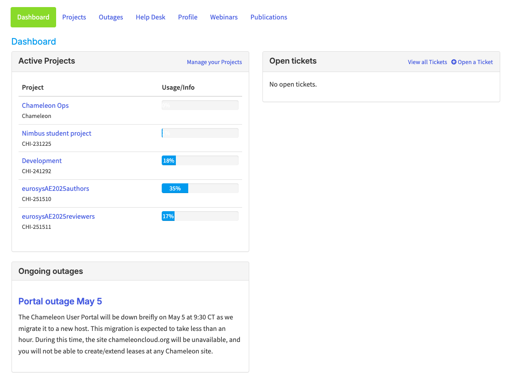
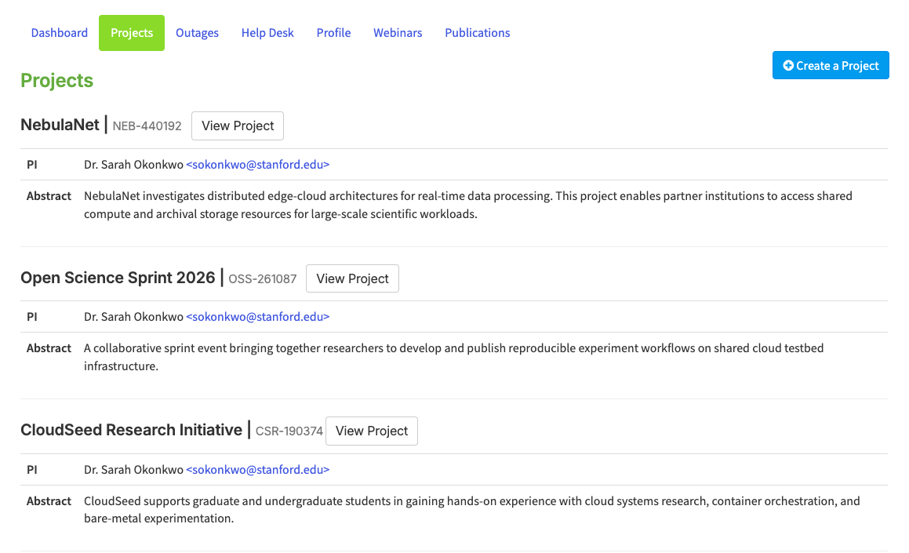
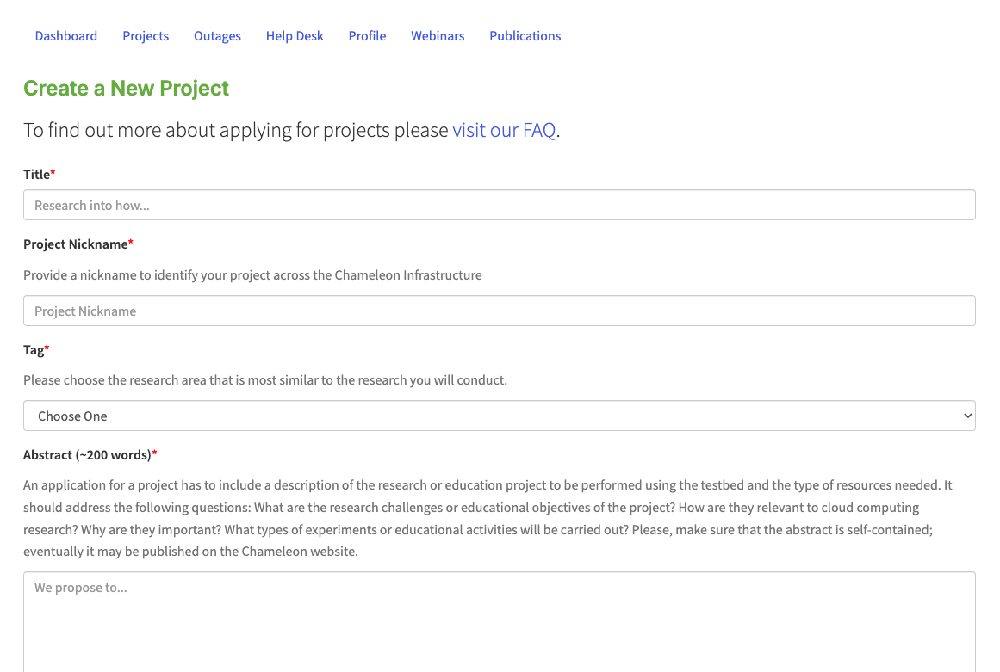
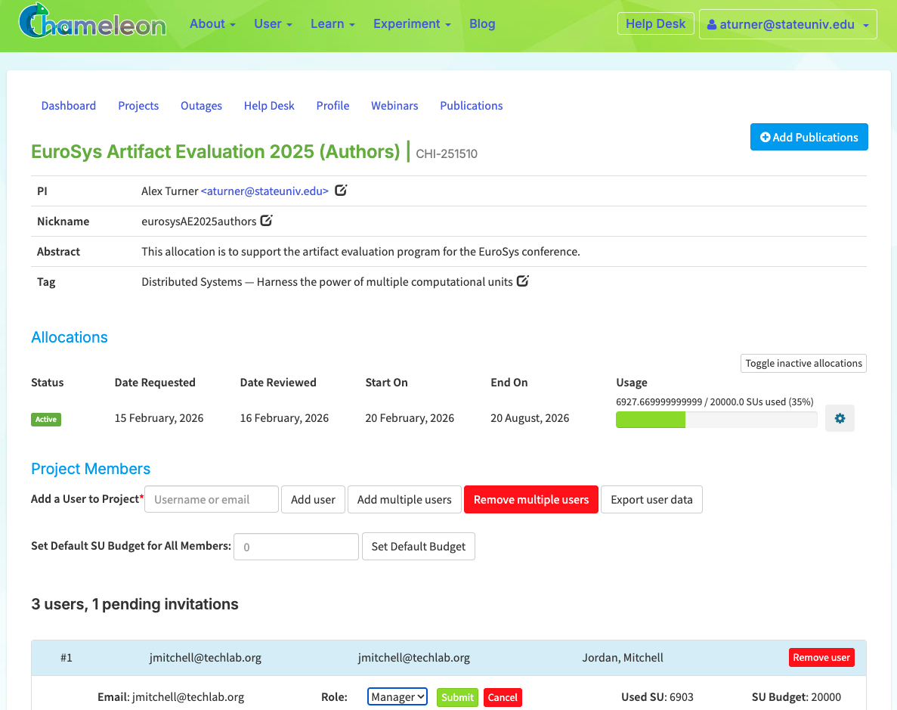
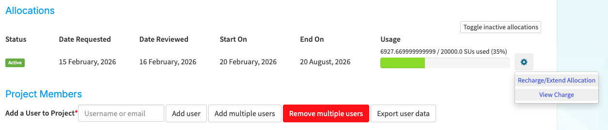
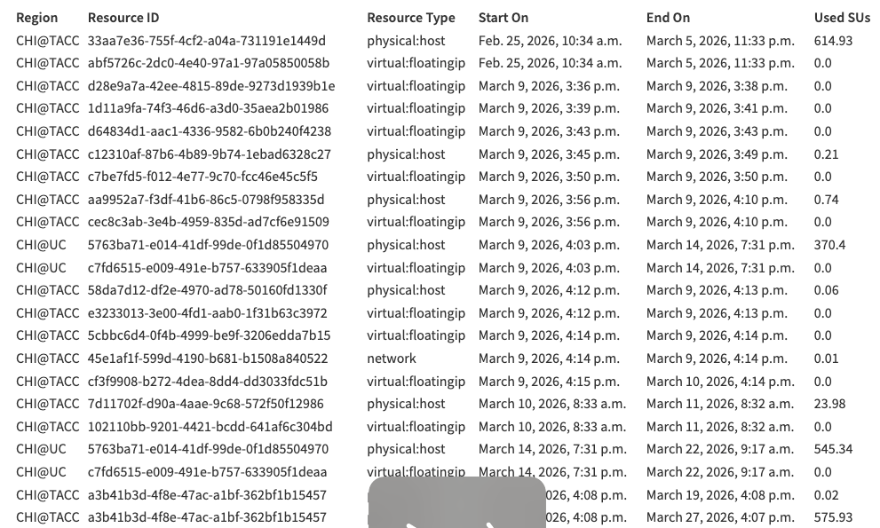
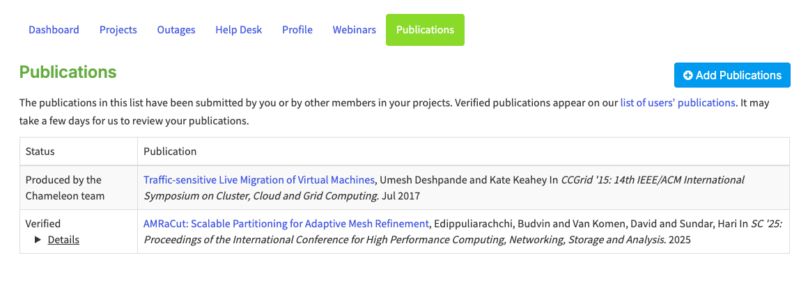
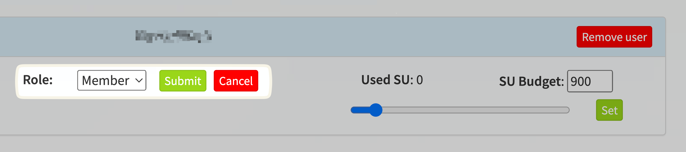

.. _project-management:

==================
Project management
==================

Project management tasks, such as adding users to your project or requesting a
renewal, is performed through the portal at https://chameleoncloud.org. After
you have `registered <https://www.chameleoncloud.org/user/register/>`_ and
verified your email address, you may `login to the portal
<https://www.chameleoncloud.org/login/>`_. Once logged in, you should be at
*Dashboard* page automatically. If not, you can access your *Dashboard* via the
dropdown list on top right of the screen.

.. _dashboard-page:

Dashboard
=========

The Dashboard's main page consists of two control panels - the *Active Projects*
control panel and the *Open Tickets* panel.

  The project dashboard

The *Active Projects* control panel allows you to view all your active projects
and their current usage. You may click on a project to view details.

The *Open Tickets* panel lists all your active help desk tickets. In addition,
you can `Open a Ticket <https://www.chameleoncloud.org/user/help/ticket/new/>`_
via the *Open Tickets* panel.

.. _projects-page:

Projects
========

The Dashboard's `Projects Page <https://www.chameleoncloud.org/user/projects/>`_
allows you to manage your current projects.

  Project list

Each individual *Project* has its own:

- Service Unit allocations
- Users that have access to the project
- System resources such as *Security Groups*, *Floating IP Addresses* and
  *Instances*
- Assets such as snapshots, object containers, metrics and network configuration

Creating a Project
------------------

To create a project, click the *+Create a Project* button. After filling out and
submit the request form, a system administrator will review your request and
notify you once your project get approved. Project durations are six months with
a default allocation of 20,000 :ref:`service-units`.

  The Create a New Project form

.. _service-units:

Service Units
-------------

One Service Unit (SU) is equivalent to one hour of usage of one allocatable
resource (physical hosts, network segments, or floating IPs). For example, a
reservation for 5 Skylake compute nodes for 8 hours would use 40 SUs. However,
for certain types of resources, more SUs will be charged. For more details about
allocation charges, please see `here
<https://www.chameleoncloud.org/learn/frequently-asked-questions/#toc-what-are-the-units-of-an-allocation-and-how-am-i-charged->`_.

.. _project-details:

Project Details
---------------

Clicking on a project from either the :ref:`dashboard-page` main page or the
:ref:`projects-page` page will allow you to manage one of your approved
*Projects*.

  Project details

In the details page of your project, you may :ref:`recharge or extend your
allocation <recharge-extend-allocation>`, :ref:`view allocation usage details <view-charge>`,
and :ref:`manage users <manage-users>` of your project.

.. _recharge-extend-allocation:

Recharge or Extend Your Allocation
----------------------------------

  Allocation actions

In the *Allocations* section of your :ref:`project-details`, you may view your
project start and end dates, current *Service Unit* usage and request a
*Service Unit* recharge or project extension. To request a *Service Unit* recharge or
*Project* extension, click the *gear* button at the end of the
allocation row, and then click *Recharge/Extend Allocation*. 
When requesting renewal or recharge of the allocations, we may
ask you to update your :ref:`publications dashboard <manage-publications>`, so
keeping it up to date now can save you time later! 

.. _view-charge:

View Allocation Usage Details
------------------------------

  Allocation usage details

To view the allocation usage details, in the *Allocations* section,
click the *gear* button at the end of the
allocation row, and then click *View Charge*. This will open a modal
displaying a list of all charges against your allocation, including
who initiated the charge, how many *Service Units* were charged, and
what type of charge it was. 

.. _manage-publications:

Manage Publications
--------------------

To add publications to a project, click the *Add Publications* button in the
:ref:`project-details` page. Please enter the publications in BibTex format. All
regular BibTex publication types are supported. If you can provide a link,
please enter as *note* or *howpublished* using the url package.

To manage the publications you have entered, use the *Publications Dashboard*.

  
  Publications dashboard
  
In the dashboard, you may remove a publication of a project by clicking the -
button next to the publication text. 

.. _manage-roles:

Manage User Roles (PI Delegate)
-------------------------------

To manage user roles of a *Project*, use the *Project Members* section in the 
:ref:`project-details`. The table below shows the types of roles and their
privileges. 

+---------+---------------------------------------------------------------------------+
| Role    | Description                                                               |
+=========+===========================================================================+
| PI      | Each project has only one PI. PI can manage roles of the project members. |
+---------+---------------------------------------------------------------------------+
| Manager | Each project can have multiple Managers. Managers can manage the          | 
|         | membership of the project.                                                |
+---------+---------------------------------------------------------------------------+
| Member  | Members can only view the list of the project members.                    |
+---------+---------------------------------------------------------------------------+

To change the role of a project member, click the *gear* button at the end of the
user row, and then click *Change Role*. It will enable the role dropdown.
Choose a new role and click the *Submit* button to apply the new role to the user, or
use the *Cancel* button to cancel the action.

  
  Manage Role of a User

.. _manage-users:

Manage Users
------------

To manage users of a *Project*, use the *Project Members* section in the
:ref:`project-details`. While each user has their own Chameleon User account
independent of your project, they may be added to one or more projects. Being a
user of a *Project* **does not** require a :ref:`PI eligibility
<pi-eligibility>`.

You may add a user to your project by filling out their user name or email
address and clicking the *Add user* button. You may remove a user from your
project by locating the user in the user list; clicking the *gear* button
at the end of the row; and clicking *Remove user*.

If there is no user associated with an email address, an invitation will be sent
with a link. When someone clicks on this link, they will be prompted to sign in
or create an account, and then automatically added to the project. Invitations
show up at the bottom of the members list, and can be deleted or resent if needed.
After an invitation is accepted, the user will show up under the *Project Members*
section.
