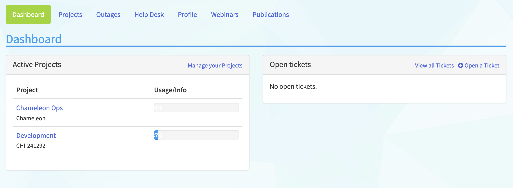
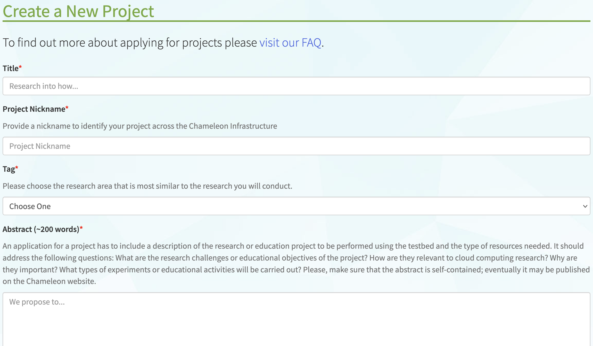
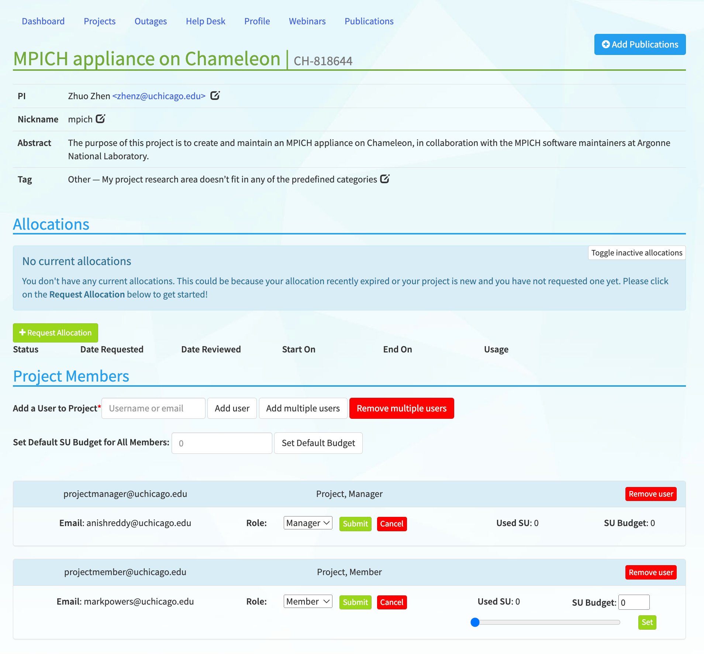
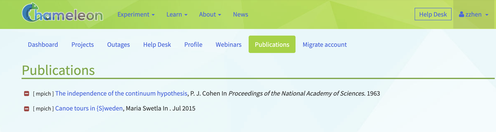

.. _project-management:

==================
Project management
==================

Overview
========

Projects are the fundamental organizing unit for research on Chameleon. Each project provides:

- **Resource allocations** measured in Service Units (SUs) for computational time
- **User management** with role-based access control (PI, Manager, Member)
- **Resource isolation** with dedicated security groups, networks, and storage
- **Usage tracking** and billing management for fair resource sharing

All project management tasks are performed through the `Chameleon portal <https://www.chameleoncloud.org>`_. After
you have `registered <https://www.chameleoncloud.org/user/register/>`_ and
verified your email address, you may `login to the portal
<https://www.chameleoncloud.org/login/>`_. Once logged in, you should be at
*Dashboard* page automatically. If not, you can access your *Dashboard* via the
dropdown list on top right of the screen.

**Quick Navigation**

- :ref:`Dashboard overview <dashboard-page>` - View projects and tickets
- :ref:`Creating a project <creating-a-project>` - Start a new research project  
- :ref:`Managing users <manage-users>` - Add/remove team members and set roles
- :ref:`Allocation management <recharge-extend-allocation>` - Request renewals and recharges
- :ref:`Publications tracking <manage-publications>` - Maintain research output records

**Related Documentation**

- :doc:`PI eligibility requirements <pi_eligibility>` - Criteria for creating projects
- :doc:`User authentication <federation>` - Login and account setup
- :doc:`Getting help <help>` - Support channels and community resources

.. _dashboard-page:

Dashboard
=========

The Dashboard's main page consists of two control panels - the *Active Projects*
control panel and the *Open Tickets* panel.

  The project dashboard

The *Active Projects* control panel allows you to view all your active projects
and their current usage. You may click on a project to view details.

The *Open Tickets* panel lists all your active help desk tickets. In addition,
you can `Open a Ticket <https://www.chameleoncloud.org/user/help/ticket/new/>`_
via the *Open Tickets* panel.

.. _projects-page:

Projects
========

The Dashboard's `Projects Page <https://www.chameleoncloud.org/user/projects/>`_
allows you to manage your current projects.

.. figure:: project/projects.png
  :alt: Project list

  Project list

Each individual *Project* has its own:

- Service Unit allocations
- Users that have access to the project
- System resources such as *Security Groups*, *Floating IP Addresses* and
  *Instances*
- Assets such as snapshots, object containers, metrics and network configuration

.. _creating-a-project:

Creating a Project
------------------

To create a project, click the *+Create a Project* button. After filling out and
submit the request form, a system administrator will review your request and
notify you once your project get approved. Project durations are six months with
a default allocation of 20,000 :ref:`service-units`.

  The Create a New Project form

.. _service-units:

Service Units
-------------

One Service Unit (SU) is equivalent to one hour of usage of one allocatable
resource (physical hosts, network segments, or floating IPs). For example, a
reservation for 5 Skylake compute nodes for 8 hours would use 40 SUs. However,
for certain types of resources, more SUs will be charged. For more details about
allocation charges, please see `here
<https://www.chameleoncloud.org/learn/frequently-asked-questions/#toc-what-are-the-units-of-an-allocation-and-how-am-i-charged->`_.

.. _project-details:

Project Details
---------------

Clicking on a project from either the :ref:`dashboard-page` main page or the
:ref:`projects-page` page will allow you to manage one of your approved
*Projects*.

  Project details

In the details page of your project, you may :ref:`recharge or extend your
allocation <recharge-extend-allocation>`, :ref:`view allocation usage details <view-charge>`,
and :ref:`manage users <manage-users>` of your project.

.. _recharge-extend-allocation:

Recharge or Extend Your Allocation
----------------------------------

.. figure:: project/allocationactions.png
  :alt: Allocation Actions

  Allocation actions

In the *Allocations* section of your :ref:`project-details`, you may view your
project start and end dates, current *Service Unit* usage and request a
*Service Unit* recharge or project extension. To request a *Service Unit* recharge or
*Project* extension, click the *gear* button at the end of the
allocation row, and then click *Recharge/Extend Allocation*. 
When requesting renewal or recharge of the allocations, we may
ask you to update your :ref:`publications dashboard <manage-publications>`, so
keeping it up to date now can save you time later! For questions about allocation
management, visit our `Community Forum <https://forum.chameleoncloud.org>`_ or
contact the :doc:`Help Desk <help>`. 

.. _view-charge:

View Allocation Usage Details
------------------------------

.. figure:: project/allocationusagedetails.png
  :alt: Allocation Usage Details

  Allocation usage details

To view the allocation usage details, in the *Allocations* section,
click the *gear* button at the end of the
allocation row, and then click *View Charge*. This will open a modal
displaying a list of all charges against your allocation, including
who initiated the charge, how many *Service Units* were charged, and
what type of charge it was. 

.. _manage-publications:

Manage Publications
--------------------

To add publications to a project, click the *Add Publications* button in the
:ref:`project-details` page. Please enter the publications in BibTex format. All
regular BibTex publication types are supported. If you can provide a link,
please enter as *note* or *howpublished* using the url package.

To manage the publications you have entered, use the *Publications Dashboard*.

  
  Publications dashboard
  
In the dashboard, you may remove a publication of a project by clicking the -
button next to the publication text. 

.. _manage-users:

Manage Users
------------

In the dashboard, you can add or remove users (or "members") from your
projects, manage your project members' user roles, and allocate how many SUs
each project member can consume on your project allocation.

.. _user_roles:

User Roles
~~~~~~~~~~

To manage user roles for a *Project*, scroll down to the *Project Members*
section in the :ref:`project-details` page of your dashboard. The table below
shows the types of roles that members can have and their privileges.

+---------+---------------------------------------------------------------------------+
| Role    | Description                                                               |
+=========+===========================================================================+
| PI      | Each project has only one PI. PI can manage roles of the project members. |
+---------+---------------------------------------------------------------------------+
| Manager | Each project can have multiple Managers. Managers can manage project      | 
|         | membership and renew allocations of the project.                          |
+---------+---------------------------------------------------------------------------+
| Member  | Members can only view the list of the project members.                    |
+---------+---------------------------------------------------------------------------+

To change the role of a project member, choose a new role from the dropdown and
click the *Submit* button to apply the new role to the user, or
use the *Cancel* button to cancel the action.

  Manage Role of a User

.. _set-SU-budgets:

Set SU Budgets for Project Members
~~~~~~~~~~~~~~~~~~~~~~~~~~~~~~~~~~

The PI or project managers can set a service unit (SU) budget for each project
member. This budget limits the resources that a project member can utilize from
the project's total SU allocation. Managing these budgets ensures fair
distribution of resources and effective utilization of project resources across
multiple project members. Setting a user-specific budget can help when managing
resources for a project with lots of members (a large collaborative research
project or a classroom project, for instance) and ensure that project
allocations are shared effectively between project members.

Project managers (including PIs) can set a default SU budget that is applied to
all project members except managers. All new users added to the project will
receive the same default SU budget upon joining.

**Viewing User SU Budgets** - Project members will have their SU budget
displayed next to their name in the *Project Members* table. This represents
the allocation of resources that they can utilize within the project.

Project managers may also set different limits for different users. To adjust
the SU budget for a specific user, use the slider or the SU Budget field to
*Set* the new budget for an individual user.

.. _add-remove-members:

Adding and Removing New Members
~~~~~~~~~~~~~~~~~~~~~~~~~~~~~~~

To add or remove users of a *Project*, use the *Project Members* section in the
:ref:`project-details` page on your dashboard.

You may add a user to your project by filling out their username or email
address and clicking the *Add user* button. While each user has their own
Chameleon User account independent of your project, they may be added to one or
more projects. Being a user of a *Project* **does not** require PI eligibility
(see our :doc:`PI eligibility guide <pi_eligibility>` for details on project creation requirements).

You may remove a user from your project by locating the user in the user list;
clicking the *gear* button at the end of the row; and clicking *Remove user*.

It is also possible to bulk-add a large list of users by clicking the "Add
multiple users" button, or remove all users without the Manager role by
clicking the "Remove multiple users" button. Additionally, under this option
there is a link which you can send to users that will allow them to request to
join your project after they sign in to Chameleon. Once a request is made, the
managers of a project will be notified, and will need to confirm the user.

  
  Adding multiple users

If there is no user associated with an email address, an invitation will be
sent with a link. When someone clicks on this link, they will be prompted to
sign in or create an account, and then automatically added to the project.
Invitations show up at the bottom of the members list, and can be deleted or
resent if needed. After an invitation is accepted, the user will show up under
the *Project Members* section.
